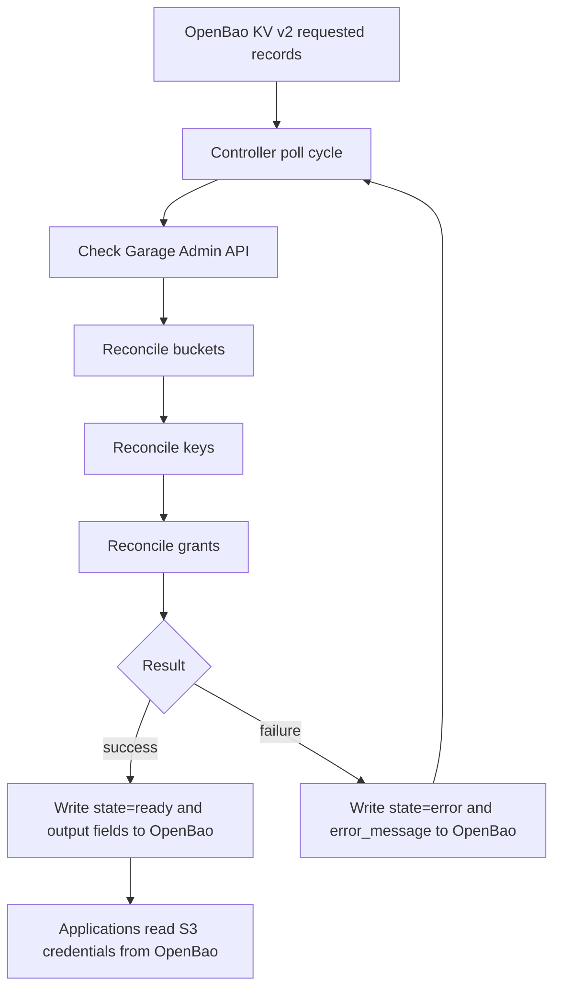

# garage-secrets-controller

`garage-secrets-controller` provisions [Garage](https://garagehq.deuxfleurs.fr/) S3 buckets, access keys, and bucket
grants from [OpenBao](https://openbao.org/) KV v2 records.

Use it when one Garage cluster serves one or more applications and those applications need S3 credentials stored in
OpenBao. Apps write requested bucket, key, and grant records under a shared prefix. The controller reconciles those
records against Garage, then writes status and generated credentials
back to OpenBao for applications to consume.

The current backend targets Garage Admin API v2 and OpenBao KV v2.

## Use Case

A typical setup has three parts:

- A Garage instance that owns the S3-compatible buckets and access keys.
- An OpenBao instance that stores desired state and generated secrets.
- Applications that read their `access_key_id` and `secret_access_key` from OpenBao instead of receiving them by hand.

The controller closes the gap between application intent and Garage state. A platform operator or deployment pipeline
writes records such as `garage/buckets/photos`, `garage/keys/media-api`, and `garage/grants/media-api--photos`. The
controller creates the missing Garage resources, applies the grant, and updates OpenBao records to `state=ready`.

## Reconciliation Cycle

Each cycle checks Garage health, then reconciles resources in dependency order:

1. Buckets: create missing Garage buckets and store `garage_bucket_id`.
2. Keys: create missing Garage keys and store `access_key_id` plus `secret_access_key`.
3. Grants: allow the key on the bucket with the requested `read`, `write`, and `owner` flags.

Records with no `state`, `state=requested`, or `state=error` are eligible for reconciliation. Ready records are skipped.



## Quick Start

This quick start assumes Garage and OpenBao already exist.

Prerequisites:

- A Garage Admin API endpoint and admin token.
- An OpenBao token that can list, read, and write the KV v2 paths used by the controller.
- A KV v2 mount, usually `kv`.

Create requested records in OpenBao:

```bash
bao kv put kv/garage/buckets/my-app-bucket state=requested
bao kv put kv/garage/keys/my-app-key state=requested
bao kv put kv/garage/grants/my-app-key--my-app-bucket \
  key=my-app-key \
  bucket=my-app-bucket \
  read=true \
  write=true \
  owner=false \
  state=requested
```

Run the controller against those existing services:

```yaml
services:
  garage-secrets-controller:
    build: .
    environment:
      BAO_ADDR: https://bao.example.com
      BAO_TOKEN: ${BAO_TOKEN}
      BAO_KV_MOUNT: kv
      BAO_PREFIX: garage
      GARAGE_ADMIN_URL: https://garage-admin.example.com
      GARAGE_ADMIN_TOKEN: ${GARAGE_ADMIN_TOKEN}
      POLL_INTERVAL_SECONDS: "30"
      RUST_LOG: info
```

Check the generated key material after the cycle completes:

```bash
bao kv get kv/garage/keys/my-app-key
```

Run one reconciliation pass instead of continuous polling:

```bash
docker compose run --rm \
  -e ONCE=true \
  garage-secrets-controller
```

## Configuration

CLI flags and environment variables:

- `--bao-addr` / `BAO_ADDR` defaults to `http://openbao:8200`.
- `--bao-token` / `BAO_TOKEN` is required.
- `--bao-kv-mount` / `BAO_KV_MOUNT` defaults to `kv`.
- `--bao-prefix` / `BAO_PREFIX` defaults to `garage`.
- `--garage-admin-url` / `GARAGE_ADMIN_URL` defaults to `http://garage:3903`.
- `--garage-admin-token` / `GARAGE_ADMIN_TOKEN` is required.
- `--poll-interval-seconds` / `POLL_INTERVAL_SECONDS` defaults to `30`.
- `--once` / `ONCE` exits after one reconciliation cycle.
- `--dry-run` / `DRY_RUN` logs actions without writing resources or status.

## OpenBao Data Model

Default KV mount: `kv`

Default prefix: `garage`

Paths:

- `kv/data/garage/buckets/<bucket-name>`
- `kv/data/garage/keys/<key-name>`
- `kv/data/garage/grants/<grant-name>`

Bucket input:

```json
{
  "state": "requested"
}
```

Bucket ready output:

```json
{
  "name": "my-app-bucket",
  "state": "ready",
  "garage_bucket_id": "...",
  "updated_at": "..."
}
```

Key input:

```json
{
  "state": "requested"
}
```

Key ready output:

```json
{
  "name": "my-app-key",
  "state": "ready",
  "access_key_id": "...",
  "secret_access_key": "...",
  "updated_at": "..."
}
```

Grant input:

```json
{
  "key": "my-app-key",
  "bucket": "my-app-bucket",
  "read": true,
  "write": true,
  "owner": false,
  "state": "requested"
}
```

Grant ready output keeps the requested fields and adds `state=ready` plus `updated_at`.

Error output keeps the existing record fields and adds:

```json
{
  "state": "error",
  "error_message": "...",
  "updated_at": "..."
}
```

## Known Limitations

- Garage Admin API field and route shape can vary by version; this controller targets v2.3.x semantics.
- V1 grants only apply positive flags through allow calls. Setting a flag to `false` does not revoke an existing
  permission.
- If a Garage key exists but OpenBao has no stored secret for it, the controller skips key reconciliation because Garage
  does not expose the secret again.
- OpenBao writes have no CAS/version preconditions.
- The controller uses polling, not OpenBao watches.

## Development

Local stack setup, smoke tests, and repository notes are in [DEVELOPMENT.md](DEVELOPMENT.md).

## License

Licensed under the Apache License, Version 2.0.
See [https://www.apache.org/licenses/LICENSE-2.0](https://www.apache.org/licenses/LICENSE-2.0).
